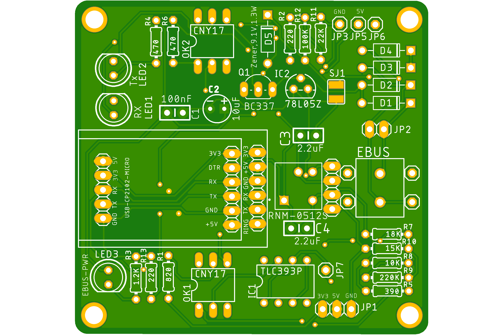

# ebus-adapter

This is an open source reimplementation of adapter boards for [eBUS daemon project](https://github.com/john30/ebusd). Currently only base board v2.2 is provided.

# Base Board v2.2

This board was designed by [Daniel Ismail](https://github.com/daniism)

See https://ebus.github.io/adapter/base.en for more information.

EAGLE files are available in [baseboard_v2.2](baseboard_v2.2) directory.

Fabrication files (Gerber files) are available in [baseboard_v2.2/Fabrication_Files.zip](baseboard_v2.2/Fabrication_Files.zip)

